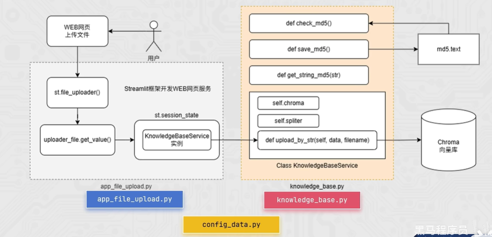
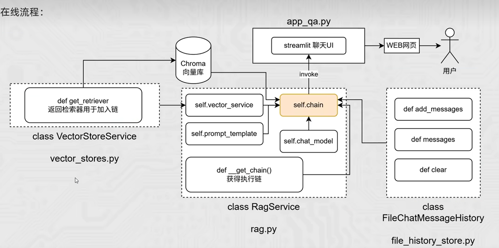

# 🧠 Private RAG Chatbot – Your Personal Knowledge Assistant
## About the Project
This project implements a simple RAG pipeline. Users can upload their own data to create a private knowledge base, then query the chatbot to receive AI-generated answers grounded in their specific information.

## ✨ Key Features
1. Real-time Retrieval: Instant indexing and querying of uploaded knowledge bases.
2. Local LLM Support: Seamless integration with local models (e.g., Ollama, Llama 3) to ensure data privacy and offline capability.

## ⚠️ Current Limitations (We’re on it!)
File Support: Currently, the system exclusively supports .txt files. We are actively working on expanding compatibility to PDF, Docx, and Markdown in future updates.

## 🧭 How It Works
### Offline Pipeline

### Online Pipeline


## 🛠️ Tech Stack
- LangChain
- OpenAI
- Ollama
- ChromaDB
- Streamlit

## 🚀 Getting Started
### 1. Prerequisites
Ensure you have the following installed:
- Python 3.9+
- Git
- (Optional) Ollama — if you plan to use local LLMs.

### 2. Installation
Clone the repository and install the required dependencies:

```bash
# Clone the repository
git clone [https://github.com/your-username/your-repo-name.git](https://github.com/your-username/your-repo-name.git)
cd [your-repo-name]

# Install dependencies
pip install -r requirements.txt
```

### 3. Setup Local LLM (Optional)
If you prefer to run the system fully offline for maximum privacy, we support Ollama.
1. **Download Ollama**: Visit and install the version for your OS.
2. **Pull the Models**: You need two models—one for Embedding (vectorizing text) and one for LLM (generating answers).
3. **Verify**: Ensure Ollama is running in your menu bar or system tray.

### 4. Configuration
To use your own LLM or Embedding model, edit the data/config_data.py file: 
```bash
embedding_model_name = "nomic-embed-text"
chat_model_name = "qwen2.5:1.5b"
```
1. Open data/config_data.py.

2. Replace the default values with your local model names:

    - Embedding: embedding_model_name = "your-model"

    - Chat LLM: chat_model_name = "your-model"

## 🎮 Usage
### 1. Upload your files
Run the uploader app:
```bash
streamlit run app_file_uploader.py
```

### 2. Ask the AI chatbot
Start the Q&A app:
```bash
streamlit run app_qa.py
```

## 📁 Project Structure
```bash
C:.
│   .gitignore
│   md5.txt
│   README.md
|  
├───chat_history
│       user_001                    # Stores user chat logs                       
│       
├───chroma_db
│   │   chroma.sqlite3              # Vector database (your knowledge base)
│
├───data                            # Core application modules
│   │   app_file_uploader.py        # Upload page
│   │   app_qa.py                   # Q&A page
│   │   config_data.py              
│   │   file_history_store.py
│   │   knowledge_base.py
│   │   rag.py
│   │   vector_stores.py
│
└───images                          # Flowcharts for the README
        Offline-Pipeline.png        
        Online-Pipeline.png
```
## 🗺️ Roadmap
Currently, the system exclusively supports .txt files. We are actively working on:

[ ] Multi-format Support: Adding PDF, Markdown, and Docx compatibility.

[ ] UI Enhancements: Improving the chatbot interface for better UX.

[ ] Hybrid Search: Combining keyword search with vector search.

